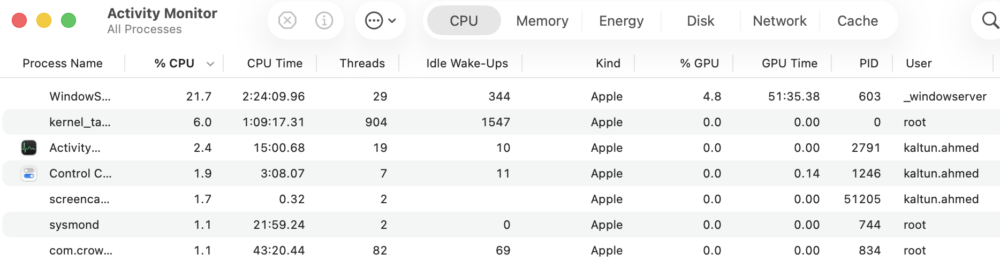

# Components of a computer

## Introduction

Before we talk about servers, deployments, or any of the CI/CD stuff, it helps
to get really concrete about what a computer is, what its important
components are, and what it's actually doing when you run a program.

## What is a computer

Historically, **_"Computer"_** meant a person who did computations by hand. In the
past, that was often women doing calculations for engineering, astronomy, and
science. Today the term universally refers to automated electronic machinery.

**The modern definition:** A computer is a programmable electronic machine that
accepts raw data, processes it using instructions, stores information, and
outputs a result.

Every modern computer is built from a combination of components that work
together to process, store, and display information. Below is a breakdown of
the essential ones.

### 1. Motherboard

A large flat circuit board that acts as the central hub of the computer.
Every other component connects to it. CPU, memory, storage, network card,
power supply. Its main role is facilitating communication between all these
components, passing electrical signals and data back and forth between them.

Think of it like a city's road network. It doesn't *do* any of the work
itself, but without it, nothing else can talk to anything else.

### 2. CPU (Central Processing Unit). The "Processor"

The CPU is what actually *does* the work. It executes instructions, one
after another, extremely fast (modern CPUs handle billions of instructions
per second). Every calculation, every decision your program makes, every line
of code you write eventually gets broken down into instructions the CPU
carries out.

### A note on chip architecture — ARM vs x86

Not all CPUs understand the exact same instructions, different CPU
"architectures" have different underlying instruction sets. The two you'll
run into most are:

- **x86 (also called x86_64 / amd64)** — the traditional architecture used by
  Intel and AMD chips, historically the standard for both laptops and
  servers
- **ARM (Apple Silicon: M1/M2/M3/M4)** — a newer, more power-efficient
  architecture. Since 2020, Apple has used ARM chips in Macs instead of
  Intel's x86

**Why this matters for you specifically:** if you're on an M1/M2/M3/M4 Mac,
your laptop's CPU is ARM. Most cloud servers, including the AWS setup we'll
use later, commonly run x86 by default. A program compiled for one
architecture generally can't run on the other without extra handling.

This becomes very relevant in Part 5, when we build Docker containers: a
container built on your Mac defaults to ARM, but if you deploy it straight to
a typical x86 AWS server, it may fail to run. Docker has ways to handle
this (specifying a target platform when building), which we'll cover when we
get there.

### 3. RAM (Random Access Memory). Short-term memory

RAM is fast, temporary storage. Whatever your program is actively working
with *right now* such as variables, open files, data mid-calculation. It all lives here.

RAM is very fast, but it's **wiped when the power turns
off**. Nothing in RAM survives a restart.

### 4. Storage (Disk). Long-term memory

Storage (a hard drive, or more commonly today an SSD (solid state drive)) is where things live
*permanently*. Your files, your installed programs, your code, your photos.
Unlike RAM, this data survives even after the computer is turned off.

### 5. Network interface

The component that lets a computer talk to other computers, either over Wi-Fi, or
a wired connection. Every request you send (loading a webpage, sending a
message) and every response you receive travels through this.

This is the piece that becomes especially important once we talk about
servers. A server's entire job depends on its network interface constantly
receiving and responding to requests.

---

### How these work together

Say you run a simple program that adds two numbers:

1. The program's instructions and data are read from **storage**
2. They get loaded into **RAM** so they're quick to access
3. The **CPU** executes the instructions, does the addition
4. The result might get saved back to **storage**, sent over the **network**,
   or just displayed on screen
5. The **motherboard** is what physically connects all of this the entire
   time, carrying the signals between each component

Every computer you'll ever touch your laptop, your phone, a server sitting
in a data center has some version of these six things.

---

## What an Operating System (OS) is

You never talk to the CPU, RAM, or storage directly yourself. Instead, there's
a layer of software sitting between you and the hardware, managing all of it —
that's the **Operating System** (Windows, macOS, or Linux, most commonly).

The OS's job:

- Decides which program gets to use the CPU, and when (your laptop is running
  dozens of programs "at once," but really the CPU is rapidly switching
  between them, giving each a tiny slice of time)
- Manages RAM — making sure one program can't just take all of it, or read
  another program's data
- Reads and writes files to storage on a program's behalf
- Handles network requests coming in and going out

**Why this matters for later:** every program you run, including a
"server", needs an OS underneath it to actually execute. When we talk later
about renting a server from AWS, what you're really renting is a computer,
with an OS already running on it, waiting for you to put your program on it.

### A useful mental model

Think of the whole computer like a restaurant kitchen:

- **Motherboard** = the kitchen itself. The walls, floor, and plumbing that
  every station is built into and connects through
- **CPU** = the chef, actually cooking
- **RAM** = the counter space where ingredients sit *right now*, mid-recipe
- **Storage** = the pantry/fridge — where everything lives long-term
- **Network interface** = the phone line taking incoming orders and calling
  them back out once ready
- **OS** = the kitchen manager — deciding which order the chef works on next,
  making sure two dishes don't collide, keeping track of where everything is

---

# See it for yourself — Activity Monitor

Everything we just covered (CPU, RAM, storage, network) can be seen on your mac in realtime.

## Opening Activity Monitor

- Press `Cmd + Space`, type "Activity Monitor," hit enter
- Or: Finder → Applications → Utilities → Activity Monitor

You'll see five tabs across the top: **CPU**, **Memory**, **Energy**, **Disk**,
**Network**. These map almost exactly onto the components we just talked
about.

## What to look at

**CPU tab**
- Shows every running program and what percentage of the CPU it's currently
  using
- Notice it's never at 0% — your OS and background programs are constantly
  using small slices of it.

**Memory tab**
- Shows how much RAM is currently in use, and by what
- "Memory Pressure" at the bottom is a simple health indicator — green means
  plenty of free RAM, red means it's under pressure and starting to slow down

**Disk tab**
- Shows data being read from and written to storage, live

**Network tab**
- Shows data currently being sent and received over your network connection

## Come back to this later

Once you get to the "run your first local server" step, open Activity
Monitor first and leave it visible. When you run `python main.py`, look for
`python` appearing in the

**Next:** [What a server is](./02-what-is-a-server.md)