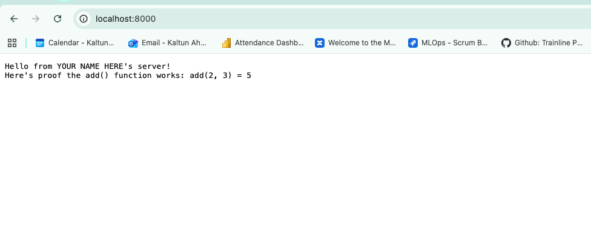

# What a server is

## The short version

A **server** is just a computer that:

1. Is turned on and connected to the internet (basically) all the time
2. Runs a program that sits there **waiting** for requests
3. **Responds** to those requests when they arrive

That's it. A server isn't a special category of hardware. It's a regular
computer, doing a specific job: waiting around to answer other computers. It
has the exact same components we just covered — CPU, RAM, storage, a
motherboard, a network interface, an OS. Nothing about it is fundamentally
different from your own laptop.

## Client and server

You'll hear "client" and "server" together constantly. Here's the
relationship:

- **Client** — the thing making a request (your browser, your phone's app)
- **Server** — the thing receiving the request and sending back a response

When you open a website:

1. Your browser (the client) sends a request: "give me the homepage"
2. A server somewhere receives that request
3. The server sends back the webpage
4. Your browser displays it

This happens in a fraction of a second, but it's genuinely just two computers
sending messages back and forth. 

## "The cloud" is just other people's servers

When people say an app "runs in the cloud," they mean: the server it runs on
isn't sitting on your desk or on premise "on-prem" it's a computer sitting in a data center owned
by a company like Amazon (AWS), Google, or Microsoft, that you're renting
access to over the internet.

## Your laptop can be a server too

**any computer can be a server**, temporarily, including yours. If your laptop runs a program that
listens for requests on a port, your laptop *is* a server. Just not one
that's on 24/7 or reachable by the whole internet.

## Ports 

A port is a connection point it's a gateway for data transfer, power delivery, and communication between your computer and external devises. 
There are two types of ports; virtual and physcial ports. 

**_Physical port:_** 
These are the ones you can actually see and plug something into:

- USB  
- HDMI 
- Ethernet 
- Audio 


**_Virtual port:_**

Virtual ports are numbered channels used purely for network communication, existing only in software.

Every device get an **IP address** this is how computers find each other on a network. The same way a street address could 
identify a building. When your browser wants to load a website, it's ultimately sending a request to the IP address of the server hosting it. 


But an IP address alone only gets a request to the right *computer*, not to the right *program on that computer*. 

A single computer can easily be running dozens of programs waiting for requests at the same time — a web
server, a database, a chat app, all on the same machine. So once a request
arrives at the right IP address, how does the computer know *which* program it's actually meant for?

That's what a **port** is for.

A port is a numbered "door" into a computer, used specifically for network traffic. 
When a program wants to receive requests, it doesn't just listen to the computer in general. It listens on a specific port number. 
A request has to specify both the IP address *and* the port it's aiming for — the IP
address gets you to the right building, the port number gets you to the right apartment.

### Well-known ports

Services generally listen on "well-known" port numbers, in the range
1–1023, reserved by convention for specific common services:

| Port | Service |
|------|---------|
| 21   | FTP (File Transfer Protocol) |
| 22   | SSH (Secure Shell) — a tunneling protocol for secure connections |
| 53   | DNS (Domain Name System) |
| 80   | HTTP (Web) |
| 443  | HTTPS (Secure Web) |
| 3389 | RDP (Remote Desktop Protocol) |

- A computer has network requests arriving through one connection, but
  65,535 possible port numbers to route them to
- Each program picks a port to "bind" to and listens there
- Two programs generally can't listen on the *same* port at the same time on
  the same computer — that's what causes the annoying "port already in use"
  error you'll eventually run into


---

#  Your turn!!! 👩🏽‍🔬 Try running a server on your own machine 👩🏽‍🔬

We're going to turn your own laptop into a server for about 30 seconds, using nothing but Python.

### Step 1: Add your name

Open `app/main.py` and find this line near the top:

```python
NAME = "YOUR NAME HERE"
```

Replace `"YOUR NAME HERE"` with your own name, then save the file.

### Step 2: Start the server 

Open the terminal in VS Code with `` Ctrl + ` ``.

Then write `pwd` (Print working directory) to see what directory/folder you're in. 

It should say `/zero-to-deploy`

Then write `cd app/` (Change dirctory into the app folder)

Write `pwd` again and it should say `/zero-to-deploy/app` 

Then we'll start the code by running `python3 main.py`

You should see:

``` 
Serving on http://localhost:8000 
```

Click on that link it should open on your browser and looks like this: 




To stop the server, press `Ctrl + C` in the terminal. It should cancel the running program.


### What `localhost:8000` means

- `localhost` means "this same computer" it's a way of a computer talking to
  itself over the network, rather than out to the internet

- `:8000` is the port it's telling the computer "of everything that might be
  listening, send this request to whatever's bound to port 8000"

`8000` isn't a standard port for anything in particular. It's just a common,
easy-to-remember number developers pick for local testing, specifically
because it's unlikely to already be in use by another program on your
machine.

change 

---
