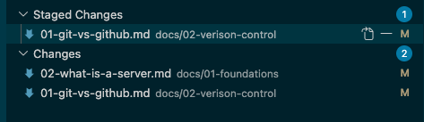

# 🗂️ Git vs Github 👩🏽‍💻

## Git: The tool that tracks changes

**Git** is a program that runs on your own computer. Its job is to track every change made to a set of files over time. 
Who changed what, when, and what the change actually was.

It was created by Linus Torvalds, the same guy who created Linux (The operating system). 

Git works entirely on your machine. You don't need the internet, an account, or any website to use it; it's just software, like any other command you run in the terminal.

To see if you have Git installed on your machine run `git --version` in the terminal. It should come pre-installed.

You should see `git version 2.50.1 (Apple Git-155)` or something simlar. 

If you don't follow this guide to install it https://git-scm.com/install/mac

## GitHub: A website that hosts Git projects

**GitHub** is a website (owned by Microsoft) that stores a copy of your Git project online. 

- You have a backup, off your own machine
- Other people can see it, download it, and contribute to it
- Your team has one shared, central copy everyone works from

GitHub isn't the only site that does this. GitLab and Bitbucket are alternatives, but GitHub is by far the most common.

You could use Git without ever touching GitHub you could just track changes locally, on your own machine, alone. But without GitHub, there'd be no easy way to share that history with anyone else, or work on the same project as a team.

--- 

## Repositories 

A **repository** (or "repo") is the project folder Git is tracking. It's not
a single file — it's a folder containing all your code, config, and
documentation, plus the entire history of every change ever made to any of
it.

When you create a new repository, two things happen:

- Git starts tracking that folder — every file inside it, every future
  change, all recorded
- A first branch is automatically created, called `main` — this becomes the
  **source of truth**: the official, working version of the project that
  everything else is measured against

A repo can live in two places at once, and this matters:

- **Locally** — the copy sitting on your own laptop, which you edit
- **Remotely** — the copy sitting on GitHub, which is the shared version
  everyone else sees and pulls from

They're kept in sync through commands like `push` (send your local changes
up to GitHub) and `pull` (bring down changes from GitHub to your local
copy)

## Branches

Since `main` is the source of truth, you generally don't want people editing it directly.
If five people all changed `main` at the same time, or someone pushed broken code straight to it, the "official" version of the project
would become unreliable for everyone.

Instead, people create **branches**. Their own copy of the code to work on in isolation, off to the side of `main`. Once their change is finished and checked, it gets merged back into `main`.

## Staging and committing

Git doesn't save every change automatically, you need to decide what gets saved,
and when, in two steps: **staging**, then **committing**.

### Staging

When you edit files, Git notices they've changed but doesn't track them as part of your history yet. 
**Staging** is how you say specify what is being changed. 

Staging lets you pick exactly which changes go into the next snapshot, rather than lumping in
unrelated edits.

### Committing

A **commit** is the actual snapshot. It takes whatever you've staged and permanently records it in the repo's history, along with a message describing what changed and why.
Every commit becomes a point you or anyone else can look back at later and see exactly what changed, when, and, if the message is good, why.

### Putting it together

A typical flow looks like:

1. Edit a file
2. `git status` — Check what's changed
3. `git add <file>` — Stage the change or `git add .` to stage every changed file in the current directory you're in
4. `git commit -m "message"` — Save it as a permanent snapshot
5. `git push` — Send it up to GitHub

Staging is like putting items in a shopping basket, you're deciding what to buy. Committing is like actually paying. It finalises that specific basket as one transaction, recorded permanently.

VS Code shows all of this visually, without needing the terminal. Click the **Source Control** icon in the left-hand menu:

Here you can see two groups: changes I've already staged with `git add`, and changes that are still unstaged. Notice you can even have staged and unstaged changes within the *same* file. Git tracks changes at the line level, not just the file level:

If I committed and pushed right now, only the staged changes would be included. The unstaged ones would stay on my machine, untouched, ready to be staged and committed separately later.

## Pull requests

Once you've made your changes on a branch and committed them, you don't just merge straight into `main` yourself.
Instead, you open a **pull request** (PR). It exists specifically to add a review step before code reaches `main`.

### Why this step matters

- A second person can catch a mistake before it reaches `main`
- It creates a paper trail — anyone can later see why a change was made,
  who approved it, and what the discussion around it was
- Many teams configure `main` so it's literally impossible to merge without
  at least one approval, and without tests passing. 

### After it's approved

Once a PR is approved (and, later, once CI passes), it gets **merged**. GitHub takes the changes from your branch and folds them into `main`. 
At that point, your branch's commits become part of `main`'s history permanently, and your branch is usually deleted, since its job is done.

## Common Git commands

| Command | What it does |
|---|---|
| `git status` | Shows what's changed in your local repo right now. Which files are modified, staged, or untracked |
| `git add <file>` | Stages a file, marks it as ready to be included in your next commit. Use `git add .` to stage everything changed |
| `git commit -m "message"` | Saves a snapshot of your staged changes, with a message describing what changed |
| `git push` | Sends your local commits up to GitHub |
| `git pull` | Fetches the latest changes from GitHub and merges them into your local copy |
| `git clone <url>` | Downloads a full copy of a remote repository onto your own machine, for the first time |
| `git branch` | Lists your local branches, and shows which one you're currently on |
| `git checkout -b <name>` | Creates a new branch and switches to it, in one step |
| `git checkout <name>` | Switches to an existing branch |
| `git merge <name>` | Merges the specified branch into the branch you're currently on |
| `git log` | Shows the commit history for the current branch |
| `git diff` | Shows the exact line-by-line changes you've made but haven't committed yet |

